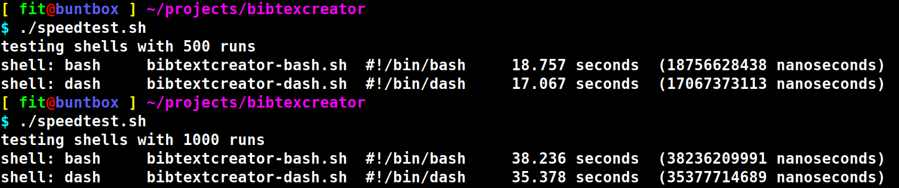
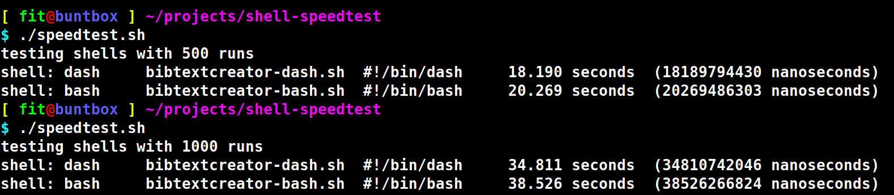

# Bash vs. Dash - a simple speed test

Somtimes when you sit down to write a shell script, efficiency is not at the front of your mind. 
As long as it does what it needs to do in a reasonable amount of time, there's usually no problem.
This is especially true of personal scripts, that may not be used more than a couple of times. 
However, it is a good practice to try and make scripts as efficient as reasonably possible. 

A simple way to improve the efficiency of a script is to use Dash instead of Bash.
Dash is quicker than Bash, we will go through a basic example that shows that.

# The script we want to test

We'll go through a program that tests two scripts, with the only difference being the path to the shell on the shebang line - `#!/bin/bash` or `#!/bin/dash`.

The scripts file names begin the same, but have `-bash` or `-dash` depending on the shebang in the file.

- bibtextcreator-bash.sh
- bibtextcreator-dash.sh

The script does basic argument handling, then uses `pdftotext` to save a neatly formatted string of the input PDF's first pages. Finally it echoes the string to /dev/null.

Searching through a PDF as if it were a plaintext file is a typical reason one might write a shell script; for example I've used `pdftotext` to grep for an ISBN or DOI and programatically do citations.


Again, the only difference is shebang line `#!/bin/bash` or ` #!/bin/dash`.

Note that I'm using ubuntu 20.04, and the the paths to these shells may be different on your system.


Now the actual script.


```shell
set -eu 

# --------------------------------------------------------------------------------------------------------------------------------------------------

if [ $# -eq 0 ]; then
    echo "The first argument should be a valid PDF"
    echo "PDFs in current dir:"
    ls -1 *.pdf
    exit 1
fi

if [ ! -f $1 ]; then
    echo "$1 does not exist"
    exit 1
fi
# --------------------------------------------------------------------------------------------------------------------------------------------------

# Save formatted text output of input PDF, using pdftotext.
#   Using "-" specifies output as std out. 
IDENTIFIER_SEARCH_AREA="$(pdftotext -layout -l 25 $1 -)"

# For the speedtest, just print to /dev/null.
echo "${IDENTIFIER_SEARCH_AREA}" >> /dev/null

# --------------------------------------------------------------------------------------------------------------------------------------------------
```

# The runner script  

Now that we have a script ready to compare the efficiency Bash and Dash, let's think about how we want to go about devising a script that acts as a runner.

We want to end up with a script where you can just run something like `shell_speedtest bash` and `shell_speedtest dash`

We could just run a simple Bash one liner to see the difference.

- `time (for i in $(seq 1 100); do  ./bibtextcreator-bash.sh testarticle.pdf; done)` 
- `time (for i in $(seq 1 100); do  ./bibtextcreator-dash.sh testarticle.pdf; done)` 

But we want an environment that can easily be changed to fit our needs. 

```shell

#!/bin/dash

set -eu

RUNS="1000"

shell_speedtest () {
    test_shell="$1"
    script_base_fname="bibtextcreator"
    script_fname="${script_base_fname}-${1}.sh" # i.e bibtextcreator-bash.sh or bibtextcreator-dash.sh
    script_shebang="$(head -n 1 ${script_fname})"
    
    printf "shell:${test_shell}\t${script_fname}\t${script_shebang}\t"
    
    # Run script x amount of times in loop.
    start_time="$(date -u +%s%N)"
    for i in $(seq 1 ${RUNS}); do  "./${script_fname}" testarticle.pdf; done
    end_time="$(date -u +%s%N)"
    
    time_delta_nanoseconds="$(expr ${end_time} - ${start_time})"
    time_delta_seconds="$(echo "${time_delta_nanoseconds} / (10^9)" | bc -l)"

    printf "%.3f seconds\t" ${time_delta_seconds}
    printf "(${time_delta_nanoseconds} nanoseconds)\n"
}

echo "testing shells with ${RUNS} runs"
shell_speedtest bash
shell_speedtest dash
```


The results show that Dash is not just trivially faster. 



Even with changing up the order of the shells, (meaning `shell_speedtest dash` gets executed first), dash is faster. 




# TODO

- [] Make the number of runs a command line arg, right now it's hard-coded.
